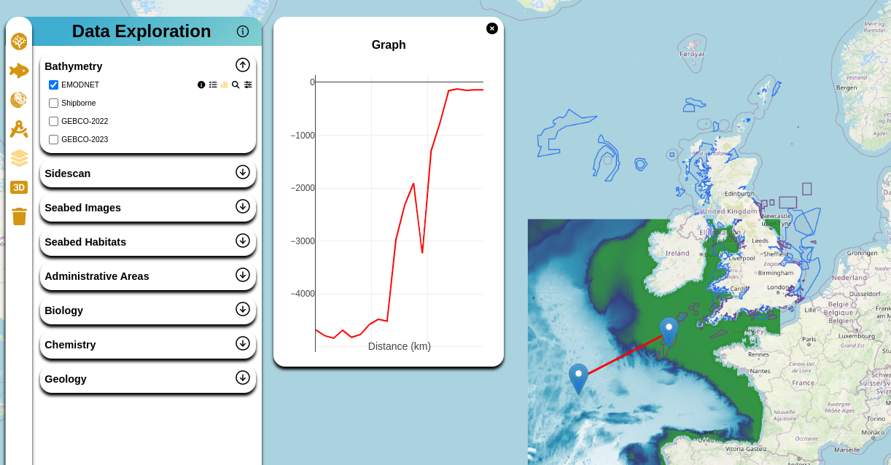

# COG (Cloud Optimized GeoTIFF)

## Introduction

In our project, we use Cloud Optimized GeoTIFF (COG) files to efficiently store and display geospatial data. This documentation explains our approach to working with COG files and outlines two distinct methods we've implemented for rendering COG data. Additionally, we emphasize the importance of using a tile server to accelerate frontend map rendering.

## Utilizing COG Images

Cloud Optimized GeoTIFF (COG) files are a specialized format for efficiently storing geospatial data. These files are optimized for performance, allowing rapid access and rendering of large datasets.

## Tile Server Approach

### 1) Tile Server powered by [www.titiler.xyz](https://www.titiler.xyz)

One of our methods for accessing COG images involves utilizing a tile server based on [www.titiler.xyz](https://www.titiler.xyz). This tile server has been deployed and is currently in production use. You can access the live deployment through the following links:

- [https://imfe-pilot-tileserver.noc.ac.uk.net/](https://imfe-pilot-tileserver.noc.ac.uk.net/)
- [https://haigfras-salt-tileserver.co.uk/](https://haigfras-salt-tileserver.co.uk/)

The source code for this tile server can be found in our GitLab repository: [tileserver](https://git.noc.ac.uk/ocean-informatics/imfepilot/tileserver). This repository contains the source code, configuration details, and documentation related to the tile server implementation.

### 2) Utilizing the [georaster](https://github.com/GeoTIFF/georaster) Library

Another approach for working with COG images involves using the [georaster](https://github.com/GeoTIFF/georaster) library. This method doesn't require a dedicated tile server. However, it's important to note that, for our project, we have determined that using a tile server significantly improves map rendering speed on the frontend.

Both our 2D and 3D maps in the project utilize the tile server option for rendering COG data, ensuring a streamlined and efficient rendering process.

## Frontend Data Processing

In addition to the tile server, we've implemented frontend code to process COG data. This functionality is powered by the [Geoblaze](https://geoblaze.io/) library, which enables direct interaction with COG files in the frontend environment. It allows us to perform various operations on COG data directly within the web application.

*The image above provides an overview of a 2D map displaying a COG image. The chart was generated using the Geoblaze library for data extraction and Plotly for plotting.*
